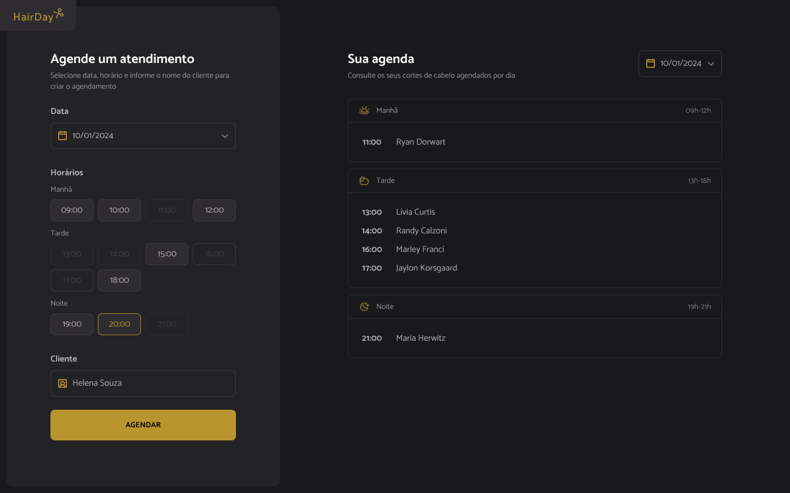

# 💇‍♀️ Projeto Hairday - Sistema de Agendamento



---

## 🚀 Tecnologias

Esse projeto foi desenvolvido com as seguintes tecnologias:

- HTML  
- CSS  
- JavaScript (ES6+)  
- Webpack + Babel  
- JSON Server (simulação de API)  
- Day.js  

---

## 💻 Projeto

Aplicação Web de agendamento de cortes de cabelo.  

- Criação de agendamentos  
- Visualização de horários disponíveis  
- Cancelamento de agendamentos  
- Manipulação de datas com **Day.js**  
- Consumo de API fake com **JSON Server**  
- Estrutura modularizada em **JavaScript**  

---

## ⚡ Como Rodar Localmente


```bash
# Instale as dependências
npm install

# Inicie o servidor fake (API mockada na porta 3333)
npm run server

# Rode o ambiente de desenvolvimento
npm run dev